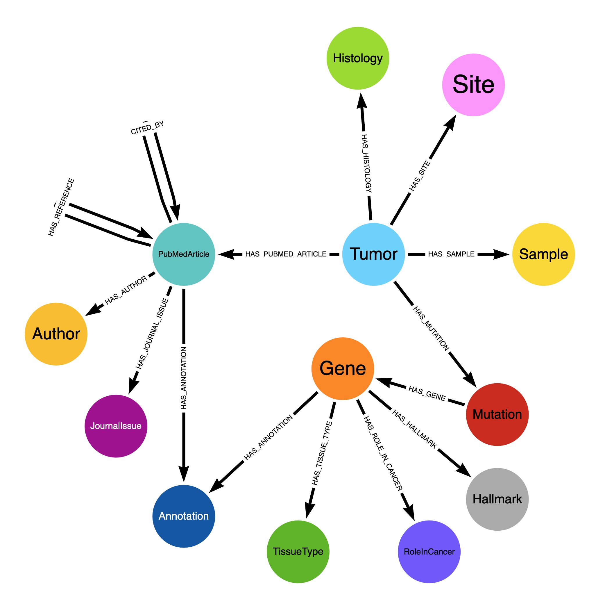

## CosmicGraphDb

CosmicGraphDb is a backend application implemented in Kotlin 1.5 that will
load data from the Catalog of Somatic Mutations in Cancer (COSMIC),
(https://cancer.sanger.ac.uk/cosmic) data files into a local Neo4j 4.3 database
(https://neo4j.com/). The major graph database nodes and relationships 
are illustrated below. This 
design diagram does not specify cardinality (e.g. A tumor may have >1 mutation).

### Requirements
The application requires the user to define two (2) system environment properties,
NEO4J_ACCOUNT and NEO4J_PASSWORD. This allows for easier code sharing without
exposing Neo4j credentials. The application logs all Neo4j CYPHER commands to a log
file in the /tmp/logs/neo4j directory. The filenames for these log files contain
a timestamp component, so they are not overwritten by subsequent executions.

The application utilizes CSV and TSV files downloaded to local storage. The location
of these files must be specified in the datafiles.properties resource file. The 
Sanger Lab requires a user license in order to download the necessary files
(https://cancer.sanger.ac.uk/cosmic/license). This repository does not provide any
COSMIC data. 

###PubMed Support
The application supplements the COSMIC data by retrieving data for PubMed articles
identified in the COSMIC files. Information is retrieved from NCBI
for the PubMed articles 
directly specified, the PubMed articles referenced by the original article, and for
the PubMed articles that cite the original article.
To accomplish this, the application utilizes the pubmed-parser library available 
from the thecloudcircle
account on GitHub (https://github.com/thecloudcircle/pubmed-parser) to map XML data
received from PubMed to Java JAXB objects.
NCBI enforces a limit of three (3) API requests per second
(10 with a registered API key). To accommodate that restriction,
the application pauses for 300 milliseconds after
each request.
