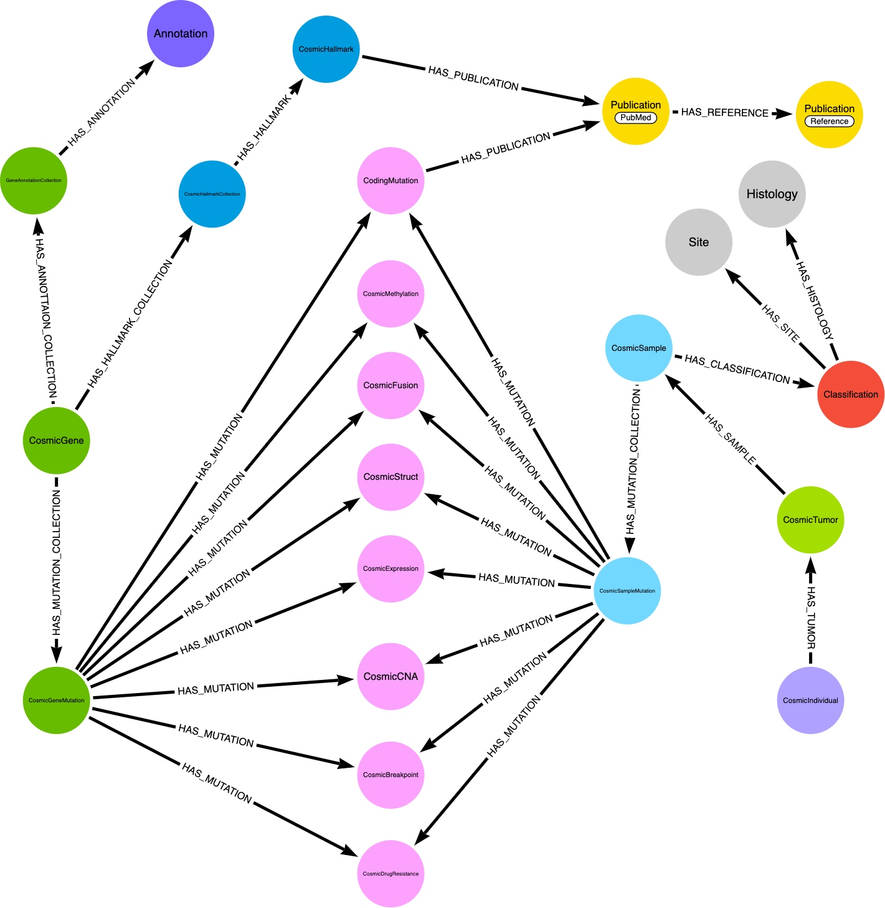

## COSMICGraphDb

COSMICGraphDb is a backend application implemented in Kotlin 1.7 that will
load data from the Catalog of Somatic Mutations in Cancer (COSMIC),
(https://cancer.sanger.ac.uk/cosmic) data files into a local Neo4j 4.4 database
(https://neo4j.com/). The major graph database nodes and relationships 
are illustrated below. This 
schema diagram does not specify cardinality (e.g. A tumor may have >1 samples).

### Application Design

The application takes advantage of Kotlin's native concurrency capabilities (i.e. channels & flows)
to minimize execution run times. Data from COSMIC files are concurrently loaded into Neo4j as soon as parent-child
dependencies are met. For example, as soon as loading the CosmicSample file is completed,
loading all the specialized mutation files is initiated. Within each loader, 
distinct tasks are run concurrently using
Kotlin channels. 
This overlap of processing tasks lowers the memory required to process the large COSMIC files.

### Requirements
The application requires the user to define a set of system environment properties.

|env variable name| description                     |example
--- |---------------------------------| ---|
NEO4J_ACCOUNT | a registered Neo4j user         | neo4j
NEO4J_PASSWORD | the password for the account    | neo4j
NEO4J_URI | the Neo4j server connection URI | neo4j://localhost:7687
NEO4J_DATABASE | the specific NEO4J database     | sample

The NE04J_URI environment property can specify a remote Neo4j database server.

### COSMIC data
The application utilizes CSV and TSV files downloaded 
from the COSMIC FTP site to local storage. The location
of these files must be specified in the datafiles.properties resource file. The 
Sanger Lab requires a user license in order to download the necessary files
(https://cancer.sanger.ac.uk/cosmic/license). This repository does not provide any
COSMIC data. 

The current data import process is based on column names specified in COSMIC Release 96. 
There are usually a small number (but breaking) of changes from one release to another.  
This repository will attempt to remain consistent with the latest COSMIC release.

### Sample *vs* Complete Loading
Many of the COSMIC files downloaded from the Sanger Lab are very large, making testing of the
loading procedure unwieldy and time-consuming. The application can accommodate loading a subset
(*i.e.* sample) of the larger files. The user can create a sample file collection by executing
the *create_cosmic_sample_files.sh* shell script from the directory containing the files downloaded
from Sanger. The single argument to this script is the number of lines to copy from the larger files.
Some of the smaller, reference files (e.g. gene census, classification) are copied over completely.

eg. create_cosmic_sample_files.sh 4000

In this example the first 4000 rows, including the header row, are used to create a sample file in the sample 
subdirectory. The new sample file must contain the header row from the original COSMIC file and retain the
same filename as the complete file.

The user should note that some Neo4j relationships that cross COSMIC files may not be completed in the resulting 
sample database. A mutation listed in the first 4000 rows of the CosmicMutantExportCensus.tsv file may be 
related to a Cosmic sample that is not within the first 4000 rows of the CosmicSample.tsv file. 
As a result, creating a Neo4j sample database should only be performed to confirm that the application is
functioning properly in the user's environment and to examine the structure of a small database instance.
Please note that when the application is invoked to load a sample database, any existing nodes and relationships
in that database are deleted.

Specifying "complete" as the NEO4J_DATABASE env property will load data from the original files downloaded from
the COSMIC FTP site and take considerably more time.

### Neo4j Database Setup

The user should use the Neo4j Desktop to create a *complete* DBMS, and optionally, a *sample* DBMS. 
The user then needs to execute the Neo4jConstraintDefinitions Kotlin application in any database created 
prior to loading any data.
This Kotlin application will only attempt to create a constraint if it has not already been defined.
The Neo4j Desktop application should be used to add the following setting options:

apoc.import.file.enabled=true

apoc.import.file.use_neo4j_config=false

dbms.jvm.additional=-Dlog4j2.formatMsgNoLookups=true

dbms.jvm.additional=-Dlog4j2.formatMsgNoLookups=true

Finally, since the loading application makes extensive use of the *Awesome Procedures On Cypher* (APOC) 
library, the Neo4j Desktop application should be used to install the latest APOV plugin.

### PubMed Support
Many of the COSMIC files (eg. Cancer_Gene_Census_Of_Cancer.tsv) contain a PubMed Id which refers
to a publication article related to a particular file entry. To support publication data in the database,
the application uses these identifiers to create placeholder (*i.e.* empty) Publication nodes with a relationship
to the node containing the COSMIC data (eg CosmicHallmark -[HAS_PUBLICATION] -> Publication/PubMed).
After all COSMIC files have been loaded, the user can fully populate these placeholder nodes by invoking the
*org.batteryparkdev.publication.pubmed.loader.PublicationLoader* application from the PublicationDataImporter 
repository against the same Neo4j database that contains the placeholder nodes. This application will scan 
the database for Publication placeholder nodes and complete them by retrieving data from NCBI. The application will
also create complete Publication/Reference nodes for every article cited as a reference in the source article and
create relationship between the original and reference article 
(eg. Publication/PubMed -[HAS_REFERENCE] ->Publication/Reference). 
If a source article is also cited as a reference, 
its node will have both PubMed and Reference labels.

The primary reason that the completion of Publication nodes was separated from loading COSMIC data was that the 
former operation takes a considerable amount of time. NCBI limits data requests to 3/second (10/second for
registered user). This restriction has been somewhat mitigated by fetching data for all of an article's 
references in a single batch request. Even with that improvement, coupling COSMIC data loading with NCBI
fetch requests proved problematic. This was due, in part, to the difficulty in maintaining consistent access to
NCBI over extended periods. Fetch requests often failed due to server 
unavailability. Because of its high level of concurrency, loading data from COSMIC files cannot be
restarted, so disruptions in NCBI service availability would require the entire data loading process to
be repeated. The publication loading application starts bt querying the database for placeholder 
Publication nodes and ignoring all others. As a result if this application terminates due to service 
disruptions, it can simply be restarted. A planned improvement is to add circuit-breaker logic to the
publication loader to automate these restarts. 

